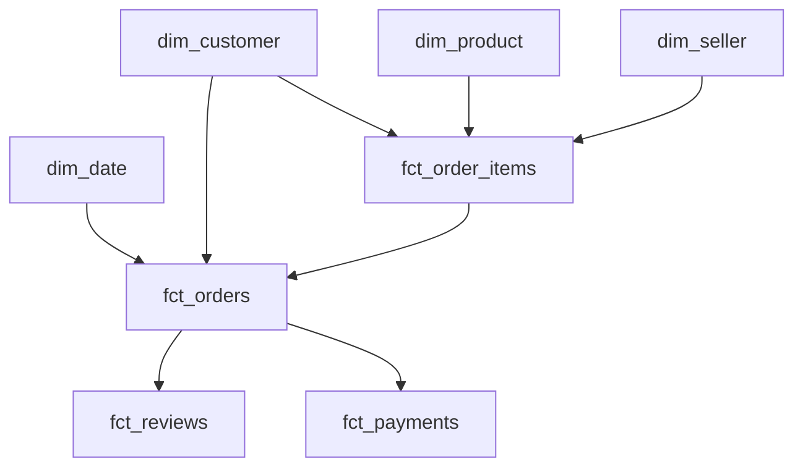



# Olist star-schema design

The analytics layer is a **fact constellation**: four facts at their natural
grains share conformed dimensions. This prevents the payment-to-item fan-out
that would overstate revenue while preserving item-level product and seller
analysis.

```text
                         dim_date
                            |
                            | purchase / review dates
                            v
dim_product <--- fct_order_items ---> dim_seller
                    |       |
                    |       +------------------+
                    |                          |
                    v                          v
              fct_orders <---------------- fct_reviews
                    |
                    +---------------- fct_payments
                    |
                    v
               dim_customer
                 (city/state)
```

The same relationship diagram is provided below as Mermaid for Markdown viewers
that render Mermaid (the text diagram above remains visible in dbt Docs).



| Model | Grain | Purpose |
|---|---|---|
| `fct_orders` | One row per order | Hub for order status, delivery performance, and reconciled order revenue. |
| `fct_order_items` | `order_id` + `order_item_id` | Atomic product/seller sales, price, and freight analysis. |
| `fct_payments` | `order_id` + `payment_sequential` | Payment-method analysis only; do not join directly to item rows. |
| `fct_reviews` | One row per review | Review score and response-time analysis; joins to `fct_orders` on `order_id`. |
| `dim_customer` | `customer_unique_id` | Stable customer, city/state, repeat behavior, lifetime revenue, and recency. |
| `dim_product` / `dim_seller` | One row per entity | Product-category and seller attributes for item-level analysis. |
| `dim_date` | One row per calendar date | Shared calendar attributes for trend reporting. |

## Why this schema design

This is a fact constellation rather than one denormalised fact table because the
source tables have different, valid grains. Order items are one-to-many with an
order, while payment records can also be one-to-many with the same order. A
single join across both would repeat payment values for every item and inflate
revenue. Keeping `fct_order_items` and `fct_payments` separate, then
reconciling both to `fct_orders`, preserves correct totals and supports detailed
product, seller, and payment-method analysis.

`fct_orders` is the business-facing hub because all three use cases are
order-led: delivery is assessed per order, a review belongs to an order, and
revenue is safely measured after payments are aggregated to order grain. This
also makes the late-delivery/review analysis a simple one-to-one join rather
than a many-to-many calculation.

The dimensions are conformed and reused across facts. `dim_customer` uses
`customer_unique_id`, rather than the order-specific `customer_id`, so repeat
purchase metrics represent real customers. Customer city/state is retained in
that dimension to make geographic revenue reporting a standard fact-to-
dimension aggregation. Product and seller dimensions similarly keep descriptive
attributes out of the atomic item fact, avoiding repeated text values and
making category and seller reporting consistent.

`dim_date` provides one shared calendar definition for order and review trends.
The schema intentionally keeps facts narrow, measures additive only at their
declared grain, and joins dimensions with stable business keys. Those choices
make the models easier to test, cheaper to query at scale, and less prone to
silently incorrect dashboard totals.

## Business-use mapping

1. **Late delivery and reviews** — join `fct_reviews` to `fct_orders` by
   `order_id`; compare `review_score` for `is_late = true` versus on-time
   delivered orders. `estimated_vs_actual_days` quantifies severity.
2. **Low repeat purchase rate** — use `dim_customer.is_repeat_customer`,
   `order_count`, `recency_days`, and `lifetime_revenue`. The key is
   `customer_unique_id`, not the order-level `customer_id`.
3. **Revenue by city** — sum `fct_orders.payment_value_total` where
   `is_revenue_order` is true, grouping by `dim_customer.customer_city` and
   `customer_state`.

## Revenue and join rules

`fct_orders.payment_value_total` is the recommended revenue measure because
payments are already aggregated to one row per order. `item_gross_total`
(`price + freight`) is retained as a reconciliation measure. Never join
`fct_payments` directly to `fct_order_items`: an order with multiple items and
payments would duplicate payment values.





Customer dimension keyed by `customer_unique_id`, the stable cross-order
identifier. It includes the latest observed customer city/state, repeat status,
recency, order count, and revenue used for retention analysis.





Order-grain accumulating snapshot. It contains lifecycle timestamps, late
delivery flags, delivery-duration measures, and pre-aggregated/reconciled
payment and item totals. Use this fact for order-level revenue.





Atomic sales fact at one row per order line. Use it for product category,
seller, price, freight, and quantity analysis; do not use it to sum payments.





Payment-instrument fact at one row per payment sequence within an order. Use it
for payment-method and installment analysis.





Review fact at one row per deduplicated review. Join to `fct_orders` on
`order_id` to evaluate the effect of delivery performance on review scores.





Conformed calendar dimension shared by order and review reporting. It flags the
incomplete source-data tail so trend charts can exclude it.





Product dimension with translated category and physical attributes. Missing
product categories are represented as `unknown` for reliable grouping.





Seller dimension with seller city/state and zip-prefix-derived coordinates.


