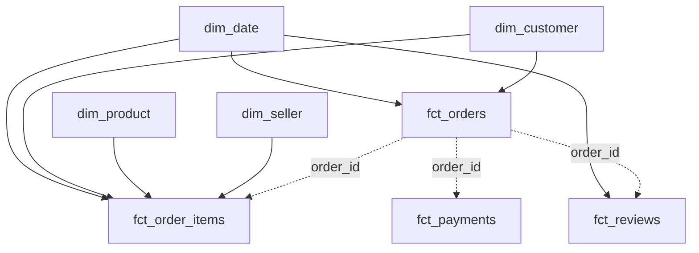

# Star schema

The `olist_marts` layer is a fact constellation: four facts retain their
natural grains and share four conformed dimensions. This prevents
payment-to-item fan-out while preserving item-level product and seller
analysis.

## Why a fact constellation

The source tables have different valid grains. One order can contain several
items and several payment records. Flattening both relationships into one wide
fact would create a many-to-many join: each payment would repeat for each item,
inflating revenue.

`fct_order_items` and `fct_payments` therefore remain separate. Each can be
aggregated safely at its own grain, while `fct_orders` provides an order-grain
hub with pre-aggregated item and payment totals.

This design also keeps measures additive only where their grain permits:

- payment value is additive across payment rows or after aggregation to order
- price and freight are additive across order-item rows
- review scores and duration metrics are analyzed, not summed
- customer counts use the stable customer key rather than order-level records

## Models and grains

| Model | Grain | Use |
|---|---|---|
| `fct_orders` | one row per order | Order status, delivery performance, and reconciled totals |
| `fct_order_items` | `order_id + order_item_id` | Product, seller, price, freight, and line gross value |
| `fct_payments` | `order_id + payment_sequential` | Payment method, installments, and payment value |
| `fct_reviews` | one deduplicated review | Review score, comments, and response time |
| `dim_customer` | `customer_unique_id` | Customer location, repeat behavior, lifetime value, and recency |
| `dim_product` | `product_id` | Product category and physical attributes |
| `dim_seller` | `seller_id` | Seller location and zip-level coordinates |
| `dim_date` | one calendar date | Shared calendar fields and complete-month flag |

### Why `fct_orders` is the hub

The primary business questions are order-led: whether delivery was late,
whether the customer reviewed the order, and how collected payment compares
with the items shipped. Keeping those order-level values in `fct_orders`
makes delivery/review analysis a one-to-one relationship after review
deduplication and provides a safe headline revenue measure.

The atomic facts remain available when analysis needs their additional detail.
For example, payment-method reporting uses `fct_payments`, while category and
seller reporting use `fct_order_items`.

## Conformed dimensions

`dim_customer` uses `customer_unique_id`, not raw `customer_id`. The latter
identifies an order-specific customer record, so using it for segmentation
would make repeat customers appear to be different people. The dimension keeps
the latest observed city/state and derives order count, lifetime revenue,
repeat status, and recency.

`dim_product` and `dim_seller` hold descriptive attributes outside the
atomic item fact. This avoids repeating category and location text on every
line and gives reports one consistent grouping definition.

`dim_date` centralizes calendar attributes for order and review trends. Its
`is_complete_month` flag protects reports from interpreting the incomplete
source tail as a business decline.

## Join rules

- Join dimensions to facts on their `*_key` columns.
- Use `customer_key`, derived from `customer_unique_id`, for customer
  analysis.
- Join companion facts through `order_id` only after respecting and, where
  needed, aggregating each fact's grain.
- Never join `fct_payments` directly to `fct_order_items` and then sum
  `payment_value`; multiple items and payments create a many-to-many fan-out.
- Use a left join when the absence of an optional event, such as a review, is
  analytically meaningful.

## Measures

| Measure | Recommended use |
|---|---|
| `fct_orders.payment_value_total` | Order-grain realized revenue and geographic revenue |
| `fct_order_items.line_gross_value` | Product- or seller-level item value: `price + freight_value` |
| `fct_orders.item_gross_total` | Order-grain comparison with payment totals |
| `fct_orders.payment_difference` | Difference between payment and item gross totals |
| `fct_orders.is_payment_reconciled` | Row-level reconciliation flag; no aggregate threshold test currently exists |

Revenue should be filtered to the intended order population. Use
`is_revenue_order` when the analysis should exclude statuses that are not
treated as realized sales.

## Business-use mapping

### Late delivery and reviews

Join `fct_reviews` to `fct_orders` by `order_id`. Compare
`review_score` for late and on-time delivered orders, using the order's
delivery-duration and delay measures to quantify severity. Keep orders without
a review when measuring review participation.

### Repeat purchase behavior

Use `dim_customer.is_repeat_customer`, `order_count`, `recency_days`, and
`lifetime_revenue`. Count `customer_key`, not `customer_id`, when
reporting unique customers.

### Revenue by geography

Join `fct_orders.customer_key` to `dim_customer.customer_key`, then group
`payment_value_total` by customer city or state. For product or seller
geography, use the order-item fact and the appropriate dimension rather than
mixing payment and line grains.

### Product and seller performance

Use `fct_order_items.line_gross_value` with `dim_product` or `dim_seller`.
This reports gross item value rather than payment value because the dimensions
join naturally at order-item grain.

## Physical layout

| Model | Partition | Cluster |
|---|---|---|
| `fct_orders` | `order_purchase_date` | `customer_key`, `order_status` |
| `fct_order_items` | `order_purchase_date` | `product_key`, `seller_key` |
| `fct_reviews` | `review_creation_date` | `order_id` |
| `fct_payments` | none | `order_id` |
| dimensions | none | their primary key |

At this dataset size, partitioning and clustering express the intended access
pattern more than they improve measurable performance. The design becomes
material when history and query volume grow.
