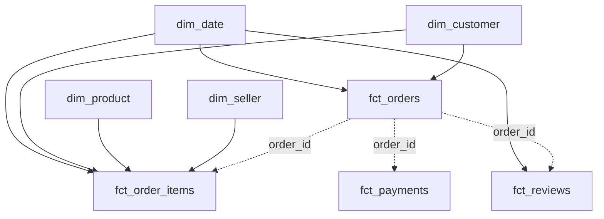

# Star schema

The `olist_marts` layer is a fact constellation: four facts keep their natural
grains and share four dimensions.

[Open the editable dimensional diagram](diagrams/02-warehouse-dimensional-model.drawio).

## Models and grains

| Model | Grain | Use |
|---|---|---|
| `fct_orders` | one row per order | Order status, delivery performance, and reconciled totals |
| `fct_order_items` | `order_id + order_item_id` | Product, seller, price, and freight analysis |
| `fct_payments` | `order_id + payment_sequential` | Payment method and installment analysis |
| `fct_reviews` | one deduplicated review | Review score, comments, and response time |
| `dim_customer` | `customer_unique_id` | Customer location, repeat behavior, lifetime value, and recency |
| `dim_product` | `product_id` | Product category and physical attributes |
| `dim_seller` | `seller_id` | Seller location |
| `dim_date` | one calendar date | Shared calendar fields and complete-month flag |

## Join rules

- Use `customer_key`, which comes from `customer_unique_id`. Raw
  `customer_id` identifies an order-specific customer record.
- Join dimensions to facts on their `*_key` columns.
- Join companion facts through `order_id` only after respecting each fact's
  grain.
- Never join `fct_payments` directly to `fct_order_items` and then sum
  `payment_value`; multiple items and payments create a many-to-many fan-out.

## Measures

- Use `fct_orders.payment_value_total` for order-grain realized revenue.
- Use `fct_order_items.line_gross_value` for product- or seller-level gross
  item value (`price + freight_value`).
- Use `fct_orders.payment_difference` and `is_payment_reconciled` to compare
  payment totals with item totals.
- Filter trend analysis with `dim_date.is_complete_month` when incomplete
  periods would distort interpretation.

## Physical layout

| Model | Partition | Cluster |
|---|---|---|
| `fct_orders` | `order_purchase_date` | `customer_key`, `order_status` |
| `fct_order_items` | `order_purchase_date` | `product_key`, `seller_key` |
| `fct_reviews` | `review_creation_date` | `order_id` |
| `fct_payments` | none | `order_id` |
| dimensions | none | their primary key |

At this dataset size, partitioning and clustering express the intended access
pattern more than they improve measurable performance.
